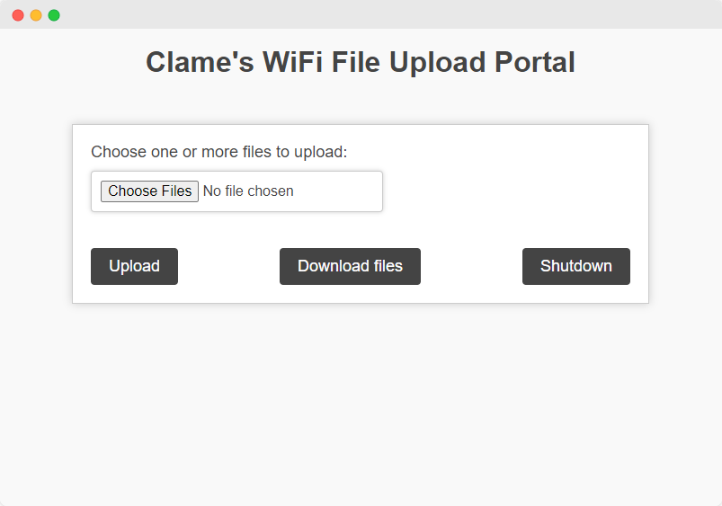

# Wifi-FTP

Wifi-FTP is a web-interfaced software written in python and html. The purpose is to transfer files using Wifi or over Lan using ethernet, with the use of Intranet. Using a micro web framework called Flask, data can be transfered from the host computer.

Can also be used from a mobile hotspot. Sharing files is not just limited to the Desktop/Laptop platform, the webpage can also be accessed from mobile/android device

## Installation - Initialization

**To install and use the script, follow these steps:**

1.  Clone the repository using `git clone https://github.com/clamesys/Wifi-FTP.git`
2.  Navigate to the cloned repository using `cd Wifi-FTP`
3.  Install the python modules `pip install -r requirements.txt`
4.  Run the script using `python app.py`
5.  Press shutdown button to kill the server process **or** route to `http://[your ip]/shutdown`

**Alternative**

- Use the compliled executable from the releases tab for windows. (be sure to use the latest release)

## How to Use

- Run the script or the executable
    - **Uploads** and **toget** folders are created
    - The code makes 2 folders in the same directory as the running script/executable
- **Uploads** folder keeps the files that have been uploaded using the webpage
- **toget** folder is where you will keep all the files, you want people to access from the webpage **Download Files** option

## Dependencies

**The script requires the following dependencies to be installed on your system:**

- os
- flask
- socket
- waitress
- webbrowser

(`pip install -r requirements.txt` already installs all the required dependencies)

## Compatibility

The script has been tested on Windows, Ubuntu, Kali, Arch, Mint, etc. It should work on other Linux-based operating systems as well.
Might aswell be operable on MacOs, **Not tested yet**.

## Dashboard Preview

## Contact

If you have any questions or feedback, feel free to contact me:

- Telegram: [@ClameSys](https://t.me/ClameSys)
- Instagram: [@clame_sys](https://www.instagram.com/clame_sys/)
